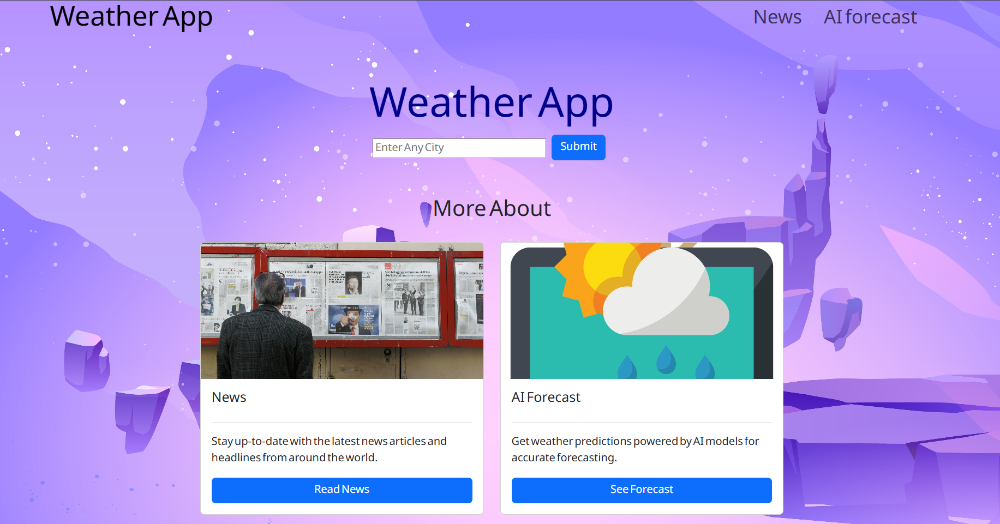
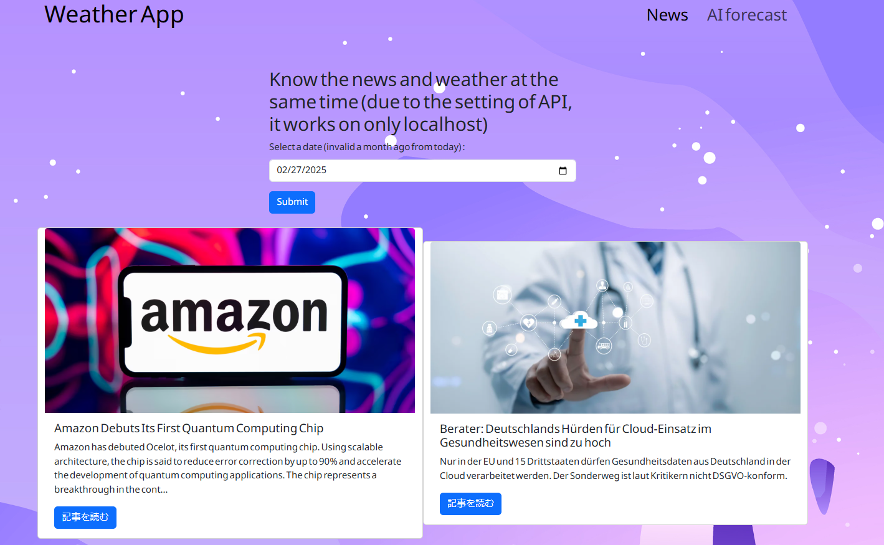

<h1>Introduction</h1>

This is the simple and easy website that get the info about weather like city, temperature, and weather condition, etc.
there are three modes in the app, just weather search, news on the specific date, and AI forecast.

 
<h2>Background why I made this app</h2>

To implement the practice of react, bootstrap and API for me as a beginner studetns

 
<h2>the home image</h2>

In the input section, you can type any city to get an info about country, and temperature

 
<h2>news mode</h2>

In the news mode, you can input the date and get the news at the day. In the source code, I use the NEWSAPI which response the news info. However, due to the pricing of API, you can use this mode in the local host, so you can download a zip, then npm install, and command "npm run dev" to use the news mode

tech stack

<ul>
    <li>Language: Javasctipt, HTML, CSS</li>
    <li>Framework: react, bootstrap, styled-components</li>
</ul>

<a href="https://weather-app-react-five-gamma.vercel.app/">URL</a>

